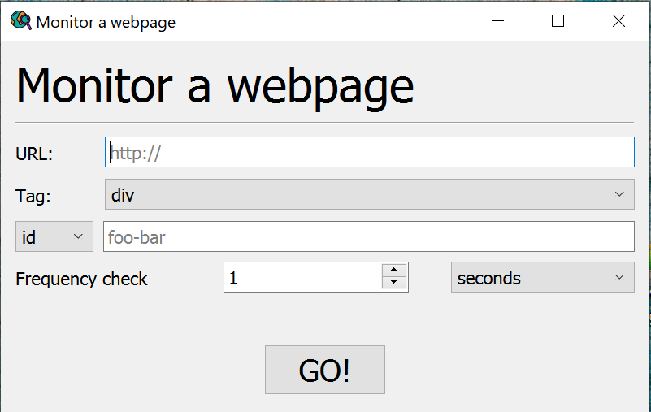

# Webpage monitor

A program that periodically checks a specified HTML tag in a webpage and stops when that tag changes, returning the value.   
Inline working, with a gui support.


## Setup
```python
# create a virtual environment
$ python3 -m venv env
$ ./env/scripts/Activate

# install dependencies
$ pip install requests beautifulsoup4 lxml pyyaml

# if you need the gui
$ pip install PyQt5

# run it
$ py main.py
```

There are two possible parameters:
- `--gui` : launches the graphical user interface
- `--from-yaml path/to/config.yaml` : loads a configuration of parameters and starts monitoring.


## Using a YAML file

The `.yaml` file has to have the following structure:

```yaml
url:
    https://www.timeanddate.com/worldclock/

# the type of HTML tag
# options: div, span, a, section, title, header, footer, h1
#          h2, h3, h4, h5, h6, nav, li, ol, p, ul, img
tag_type:
    div

# the tag's identifier
# options: id, class (one OR the other)
tag_identifier:
    my-city__clocks

# the tag's id/class value
tag_value:
    card-content

# the time measure of the check frequency.
# options: 'seconds', 'minutes', 'hours'
#          's'        'm'        'h'
freq_type:
    s

# the amount of the above specified time measure
freq_val:
    3

# this configuration will lead to monitor the tag:
#    <div class="my-city__clocks">
# every 3 seconds
```


## Using the gui


Enter the parameters in their respective fields, then press the "GO!" button.  
Until the tag changes, nothing will happen, except only a text that says "Waiting..." will keep fading in and out.  
When the tag changes, it will be presented in a box under the "GO!" button.


## Credits
Gui icon made by [Freepik](https://www.flaticon.com/authors/freepik) from [Flaticon](https://www.flaticon.com/).